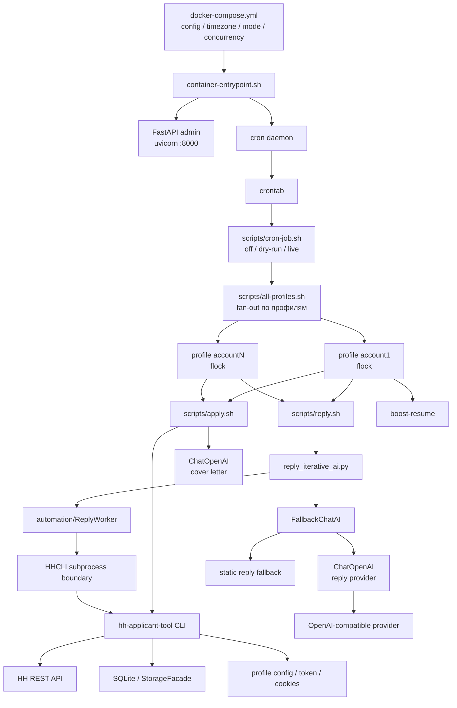
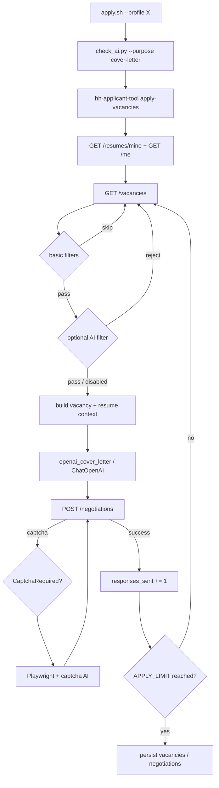
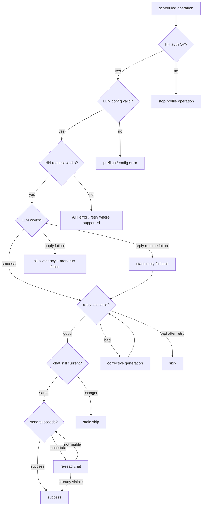

# Архитектура Work Optimization

Этот документ объясняет текущую production-архитектуру проекта с опорой на реальные entrypoint'ы и Python-модули. Его цель — быстро ответить на три вопроса:

1. кто запускает работу;
2. как один scheduled job превращается в действия по 1–10 HH-профилям;
3. где проходят границы между deterministic logic, HH API, SQLite и LLM.

Главный принцип: **LLM не является оркестратором**. Расписание, выбор профиля, фильтрация состояний, stale-check, idempotency и отправка выполняются обычным кодом. LLM используется только там, где нужен текст или распознавание капчи.

## 1. Общая схема



## 2. Control plane: кто запускает automation

Контейнерный `crontab` задаёт три production job:

| Время | Job | Entry point |
|---|---|---|
| 09:00 | boost резюме | `scripts/cron-job.sh boost` |
| 09:10 | batch откликов | `scripts/cron-job.sh apply` |
| 09:25–21:25 каждый час | ответы работодателям | `scripts/cron-job.sh reply` |

`cron-job.sh` — единая safety-граница scheduled automation. Перед запуском он проверяет `HH_AUTOMATION_MODE`:

```text
off      -> ничего не делать
dry-run  -> читать и строить preview без внешних write
actions
live     -> разрешить реальные apply/reply/boost
```

Scheduled path не пытается интерактивно авторизовать аккаунт: нижележащий CLI запускается с `--no-auto-auth`.

## 3. Multi-profile и параллельность

`scripts/all-profiles.sh` получает профили в таком порядке:

1. `.profiles`;
2. переменная `PROFILES`;
3. fallback `default`.

По умолчанию:

```dotenv
HH_PROFILE_PARALLELISM=10
```

Это означает, что до десяти HH-аккаунтов могут работать одновременно. Для каждого профиля используется отдельный `flock`:

```text
account1 -> /tmp/hh-profile-locks/account1.lock
account2 -> /tmp/hh-profile-locks/account2.lock
...
```

Lock привязан к файловому дескриптору. При crash/OOM/SIGKILL ядро освобождает его автоматически. Поэтому нет stale `mkdir`-lock, который мог бы навсегда заблокировать аккаунт.

Глобального lock на всю fleet нет. Разные профили могут продолжать работу независимо, а конфликтующая операция для уже занятого профиля будет skipped.

## 4. Изоляция профилей

Для каждого профиля разрешается отдельная директория через `utils/config.py::resolve_profile_config_dir()`:

```text
CONFIG_DIR/
└── account1/
    ├── config.json
    ├── cookies.txt
    ├── data
    └── log.txt
```

Назначение файлов:

- `config.json` — HH token/refresh token, LLM-конфиги и runtime-настройки профиля;
- `cookies.txt` — cookies web-session HH;
- `data` — SQLite snapshot/history;
- `log.txt` — CLI log профиля.

Идентификаторы профилей валидируются как `[A-Za-z0-9._-]`, чтобы named accounts не могли выйти за границы `CONFIG_DIR`.

## 5. HHApplicantTool и HH API

Центральный Python entrypoint — `src/hh_applicant_tool/main.py`.

CLI динамически загружает операции из `src/hh_applicant_tool/operations/`. Например:

```text
operations/apply_vacancies.py
        ↓
apply-vacancies
```

`HHApplicantTool` создаёт для текущего профиля:

- `requests.Session` с cookies;
- `ApiClient` для `https://api.hh.ru/`;
- `StorageFacade` поверх SQLite;
- LLM clients по назначению.

`src/hh_applicant_tool/api/client.py` отвечает за:

- finite HTTP timeout;
- delay/rate limiting между HH requests;
- Bearer access token;
- JSON parsing и typed API errors;
- refresh access token и повтор запроса при 403, если есть `refresh_token`.

После операции `main.py` сохраняет обновившийся token и cookies.

## 6. Apply pipeline

Shell entrypoint: `scripts/apply.sh`.

Ключевые величины разделены:

```text
APPLY_LIMIT       = максимум успешных откликов за run
APPLY_PAGES       = максимум страниц поиска
APPLY_PER_PAGE    = вакансий на страницу
APPLY_RUN_TIMEOUT = верхняя граница времени batch
```

Default scan depth:

```text
20 pages * 50 vacancies = до 1000 просмотренных вакансий
```

при default quota:

```text
APPLY_LIMIT=100 успешных откликов
```

Это специально: worker продолжает сканировать после уже обработанных/отфильтрованных вакансий, пока реально не достигнет quota либо не закончатся страницы.

### 6.1 Последовательность apply



### 6.2 Basic filters

`_apply_vacancies_apply_flow.py::_should_skip_vacancy_basic()` исключает, среди прочего:

- vacancy с существующими `relations`;
- archived vacancy;
- vacancy с тестом при `--skip-tests`;
- external `response_url`;
- совпадение `excluded_filter`.

`_apply_vacancies_helpers.py::_is_excluded()` проверяет сначала name/snippet, а затем при необходимости полное HTML-описание вакансии.

Autonomous `apply.sh` передаёт `--skip-tests`: vacancy tests намеренно не решаются в массовом scheduled path.

### 6.3 Cover letter

`_build_cover_letter()` собирает контекст вакансии и резюме и вызывает `openai_cover_letter` через `ChatOpenAI`.

При `AIError` конкретная vacancy не отправляется, `ai_error_count` растёт, а run в конце помечается неуспешным. **Static fallback для массовых cover letters сейчас не используется.**

### 6.4 Отправка

Обычный отклик:

```text
POST /negotiations
resume_id + vacancy_id + message
```

При `CaptchaRequired` существует отдельная ветка: Playwright открывает captcha page, vision LLM распознаёт изображение, cookies возвращаются в основную session, после чего POST повторяется.

## 7. Reply pipeline

Shell entrypoint: `scripts/reply.sh`.

Он:

1. рендерит `prompts/reply_employer.txt`;
2. в live делает `check_ai.py --purpose reply`;
3. вызывает `scripts/reply_iterative_ai.py`.

`reply_iterative_ai.py` собирает runtime:

```text
profile config
   ↓
build_ai_client()
   ↓
FallbackChatAI(primary, reply_fallback)
   ↓
ReplyWorker
```

### 7.1 Поиск кандидатов на ответ

`ReplyWorker.collect_candidate_chats()` вызывает:

```text
GET /common/chats
```

и оставляет только чаты, где:

- `type == NEGOTIATION`;
- нет `block_reason`;
- `last_message` принадлежит `EMPLOYER`.

Затем `make_decision()` загружает:

```text
GET /common/chats/{chat_id}/messages
```

и дополнительно требует:

- `write_message_state.allowed == true`;
- актуальное последнее сообщение всё ещё от работодателя;
- у последнего сообщения есть id;
- есть usable context.

Контекст ограничен последними 30 сообщениями. Для дополнительного контекста worker получает `vacancy_id` и при возможности делает `GET /vacancies/{vacancy_id}`.

### 7.2 LLM selection и fallback

Есть два разных уровня fallback.

#### Provider selection fallback

```text
openai_reply
    ↓ если секции нет
openai_cover_letter
    ↓ если валидной секции нет
configuration error / STOP
```

#### Runtime message fallback

Выбранный `ChatOpenAI` сначала выполняет собственные network/provider retries. Если после них `complete()` бросает `OpenAIError`, `FallbackChatAI` может вернуть статический `reply_fallback.message`.

Default fallback включён:

```text
Здравствуйте! Спасибо за сообщение. Я разработчик, вакансия мне интересна. Готов обсудить задачи, формат работы и ответить на вопросы.
```

Настройка профиля:

```json
{
  "reply_fallback": {
    "enabled": true,
    "message": "Здравствуйте! Вакансия интересна. Готов обсудить детали и ответить на вопросы."
  }
}
```

Fallback используется **только после `OpenAIError`**, а не вместо содержательно плохого ответа модели.

### 7.3 ChatOpenAI retries

`src/hh_applicant_tool/ai/openai.py` повторяет transient failures:

- network `RequestException`;
- HTTP 408;
- HTTP 409;
- HTTP 425;
- HTTP 429;
- HTTP 5xx.

Учитывается `Retry-After`. Битый JSON, provider `error` и неожиданная структура ответа преобразуются в `OpenAIError`.

### 7.4 Humanizer

После LLM **или static fallback** текст проходит `reply_quality_issues()`.

Проверяются:

- пустой ответ;
- длина > 2000 символов;
- длинные тире `—`/`–`;
- placeholder tokens;
- несколько характерных AI-cliche.

Для обычного LLM-текста при нарушении worker делает corrective generation. Если повторная попытка всё ещё плохая — сообщение пропускается.

### 7.5 Stale-check

Перед реальной отправкой worker **ещё раз читает чат**:

```text
GET /common/chats/{chat_id}/messages
```

Он сравнивает:

```text
latest.role == EMPLOYER
AND
latest.id == expected_last_message_id
```

Если человек уже ответил вручную либо работодатель прислал новое сообщение, старый AI reply считается stale и не отправляется.

### 7.6 Idempotent send

Для employer turn строится deterministic UUIDv5:

```text
hh-reply:{chat_id}:{employer_message_id}
```

POST:

```text
POST /common/chats/{chat_id}/messages
{
  idempotency_key,
  text
}
```

Если HTTP result неясен, worker перечитывает чат. Когда ожидаемый applicant text уже виден последним сообщением, операция считается successful и повторный send не нужен.

## 8. Dry-run semantics

### Replies

`reply.sh --dry-run`:

- читает HH chats;
- строит decisions;
- **не вызывает LLM**;
- возвращает deterministic safe preview;
- не делает POST.

### Applications

`apply.sh --dry-run` проходит selection/filtering pipeline, но внешние write блокируются. Потенциальный отклик считается accepted для моделирования per-run quota.

## 9. SQLite и admin panel

HH API остаётся внешним source of truth. SQLite — локальный snapshot/history для dashboard и повторного использования данных.

`StorageFacade` хранит, среди прочего:

- resumes;
- vacancies;
- employers;
- negotiations;
- skipped vacancies;
- vacancy contacts.

`admin/app.py` работает поверх **тех же profile directories и SQLite**, а не над отдельной базой. Admin и cron — два интерфейса к одному состоянию.

```text
             cron
              │
              v
HH API <-> profile state <-> Admin
              ^
              │
             CLI
```

## 10. Контейнерный runtime environment

`docker-compose.yml` передаёт scheduler knobs в container environment. `container-entrypoint.sh` записывает их shell-safe в `/tmp/hh-runtime.env`, потому что cron запускается с урезанным environment.

Persisted knobs:

- `HH_AUTOMATION_MODE`;
- `CONFIG_DIR`;
- `TZ`;
- `HH_NAME`;
- `HH_TELEGRAM`;
- `SEARCH_QUERY`;
- `APPLY_LIMIT`;
- `APPLY_PER_PAGE`;
- `APPLY_PAGES`;
- `APPLY_RUN_TIMEOUT`;
- `REPLY_CHATS`;
- `HH_PROFILE_PARALLELISM`.

`.env` по-прежнему поддерживается. В scheduled path runtime environment контейнера намеренно имеет приоритет над значениями из project `.env`.

## 11. Failure model



## 12. Карта кода

| Слой | Файл | Ответственность |
|---|---|---|
| Container config | `docker-compose.yml` | env, volumes, localhost admin port |
| Container startup | `container-entrypoint.sh` | cron + admin startup |
| Cron env | `scripts/write-runtime-env.sh` | shell-safe environment для cron |
| Schedule | `crontab` | boost/apply/reply times |
| Safety gate | `scripts/cron-job.sh` | `off` / `dry-run` / `live` |
| Fleet | `scripts/all-profiles.sh` | profiles, concurrency, per-profile `flock` |
| Apply shell | `scripts/apply.sh` | preflight, limits, timeout, CLI invocation |
| Apply operation | `operations/apply_vacancies.py` | top-level apply orchestration |
| Apply flow | `operations/_apply_vacancies_apply_flow.py` | filters, cover letter, POST |
| Vacancy helpers | `operations/_apply_vacancies_helpers.py` | search, regex filter, tests, HTML helpers |
| Reply shell | `scripts/reply.sh` | prompt rendering + preflight |
| Reply bootstrap | `scripts/reply_iterative_ai.py` | config + AI/fallback + worker construction |
| Reply engine | `automation/reply_worker.py` | selection, context, humanizer, stale-check, idempotent send |
| Reply fallback | `automation/reply_fallback.py` | static fallback after `OpenAIError` |
| LLM HTTP | `ai/openai.py` | OpenAI-compatible HTTP, rate limit, retries |
| AI preflight | `scripts/check_ai.py` | provider/fallback config validation + optional probe |
| CLI core | `main.py` | operation loading, profiles, auth lifecycle |
| HH HTTP | `api/client.py` | HH requests, timeout, token refresh |
| Profile paths | `utils/config.py` | profile isolation |
| Admin | `admin/app.py` | dashboard/API over same profile state |
| CI | `.github/workflows/ci.yml` | Python, LLM, shell, concurrency, Docker gates |

## 13. Mental model

Если запомнить только одну схему, то эту:

```text
                 CONTROL
        cron / admin / modes
                 │
                 v
             ORCHESTRATION
       profiles / locks / jobs
          ┌──────┴──────┐
          v             v
       APPLY          REPLY
 vacancies/filter   chats/context
          │             │
          v             v
 cover-letter LLM   reply LLM
          │          │      └─ runtime fallback
          │          v
          │       humanizer
          │          v
          │       stale-check
          │          v
          │    idempotent send
          └──────┬──────┘
                 v
               HH API
                 │
                 v
        profile SQLite/state
```

LLM можно заменить или временно потерять, не меняя control plane, profile isolation, locks, HH API client, storage и state-machine отправки. Именно поэтому automation остаётся детерминированной, а AI — заменяемым текстовым слоем.
